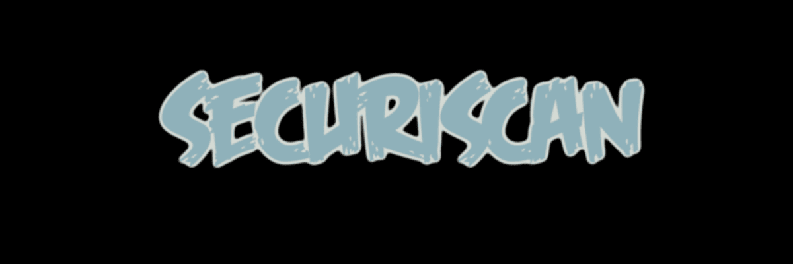

# SecuriScan





**SecuriScan** is a powerful and easy-to-use Python-based cybersecurity tool designed to scan websites for common vulnerabilities and misconfigurations. It helps security professionals, web developers, and system administrators identify and mitigate risks on websites and web applications.

### Features:
- **Outdated Libraries**: Detects vulnerable or outdated versions of popular libraries like jQuery and Bootstrap.
- **Exposed Admin Panels**: Identifies publicly accessible admin panels that could be vulnerable to unauthorized access.
- **Missing Security Headers**: Checks for missing HTTP security headers like `Strict-Transport-Security`, `X-Content-Type-Options`, and `X-XSS-Protection`.
- **Advanced Vulnerabilities**: Flags potential **CSRF**, **Directory Traversal**, **XSS**, and **SQL Injection** vulnerabilities.
- **Local Environment Detection**: Skips irrelevant checks for local testing environments (e.g., `localhost`).
- **Retry Logic**: Automatically retries failed HTTP requests to handle slow or unstable websites.

---

## Table of Contents
- [Features](#features)
- [Installation](#installation)
- [Requirements](#requirements)
- [Usage](#usage)
- [Detailed Functionality](#detailed-functionality)
- [Release Notes](#release-notes)
- [Contributing](#contributing)
- [License](#license)
- [Contact](#contact)

---

## Installation

### 1. **Install Python**
SecuriScan requires Python 3.x to run. If you don't have Python installed, you can download it from [python.org](https://www.python.org/downloads/).

### 2. **Install Required Dependencies**
SecuriScan has a few dependencies, which can be installed using `pip`. Run the following command to install the required libraries:

```bash
pip install -r requirements.txt
```

Alternatively, if you don't have a `requirements.txt` file, you can manually install the dependencies using:

```bash
pip install requests beautifulsoup4 termcolor
```

### 3. **Clone the Repository**
Clone this repository to your local machine:

```bash
git clone https://github.com/n03stalg1a/SecuriScan.git
cd SecuriScan
```

### 4. **Building the Executable (Optional)**
To convert the Python script into a standalone executable, you can use **PyInstaller**:

1. Install PyInstaller:
   ```bash
   pip install pyinstaller
   ```

2. Create the executable:
   ```bash
   pyinstaller --onefile --icon=assets/images/SecuriScan.ico SecuriScan.py
   ```

   This will generate an executable in the `dist` folder that you can run directly without needing Python installed.

---

## Requirements

- **Python 3.x**
- **Libraries**:
  - `requests`
  - `beautifulsoup4`
  - `termcolor`

These libraries are automatically installed via `requirements.txt`.

---

## Usage

Once you've installed all dependencies, you can run **SecuriScan** either as a Python script or as an `.exe` file (if you’ve built it using PyInstaller).

### **Running the Python Script**

1. Navigate to the folder containing the `SecuriScan.py` script:

   ```bash
   cd path/to/SecuriScan
   ```

2. Run the script using Python:

   ```bash
   python SecuriScan.py
   ```

3. You will be prompted to enter a URL to scan:

   ```bash
   Enter the website URL to scan using SecuriScan: https://example.com
   ```

### **Running the Executable (if packaged with PyInstaller)**

If you’ve created the `.exe` file using PyInstaller, simply double-click the `SecuriScan.exe` file or run it from the command line:

```bash
SecuriScan.exe
```

Enter the website URL when prompted.

---

## Detailed Functionality

### **Outdated Libraries**
SecuriScan scans for known outdated or vulnerable versions of popular JavaScript libraries such as jQuery and Bootstrap. It helps ensure that your website isn’t exposed to security risks associated with these libraries.

### **Exposed Admin Panels**
SecuriScan attempts to detect common admin panel URLs like `/admin`, `/wp-admin`, and `/administrator`. Exposed admin panels could be vulnerable to unauthorized access if they are not protected properly.

### **Missing Security Headers**
The tool checks for critical HTTP security headers such as `Strict-Transport-Security`, `X-Content-Type-Options`, and `X-XSS-Protection`. Missing headers can expose a website to various attacks such as **Man-In-The-Middle (MITM)** attacks and **Cross-Site Scripting (XSS)**.

### **Advanced Vulnerabilities**
- **CSRF**: SecuriScan checks if forms on the page have anti-CSRF tokens. Missing tokens can make a website vulnerable to Cross-Site Request Forgery (CSRF) attacks.
- **Directory Traversal**: The tool detects signs of directory traversal attacks, which could allow attackers to access sensitive files on the server.
- **XSS & SQL Injection**: These common attack vectors are detected based on known patterns in the page’s content.

---

## Release Notes

### **SecuriScan v1.0.0 - First Public Release**
- First official release of **SecuriScan** with Windows executable (.exe).
- Includes basic vulnerability checks: outdated libraries, exposed admin panels, missing security headers, and advanced vulnerabilities (XSS, SQLi, CSRF, etc.).
- **SecuriScan.exe** is bundled for easy use on Windows systems.

---

## Contributing

We welcome contributions to **SecuriScan**! If you’d like to contribute, please follow these steps:

1. Fork the repository.
2. Create a new branch for your changes.
3. Commit your changes.
4. Push your changes to your fork.
5. Open a pull request.

For any bug reports or feature requests, please open an issue in the [GitHub issues section](https://github.com/yourusername/SecuriScan/issues).

---

## License

SecuriScan is released under the **MIT License**. See the [LICENSE](LICENSE) file for more details.

---

### **SecuriScan** – Your first step toward securing your websites and web applications.
